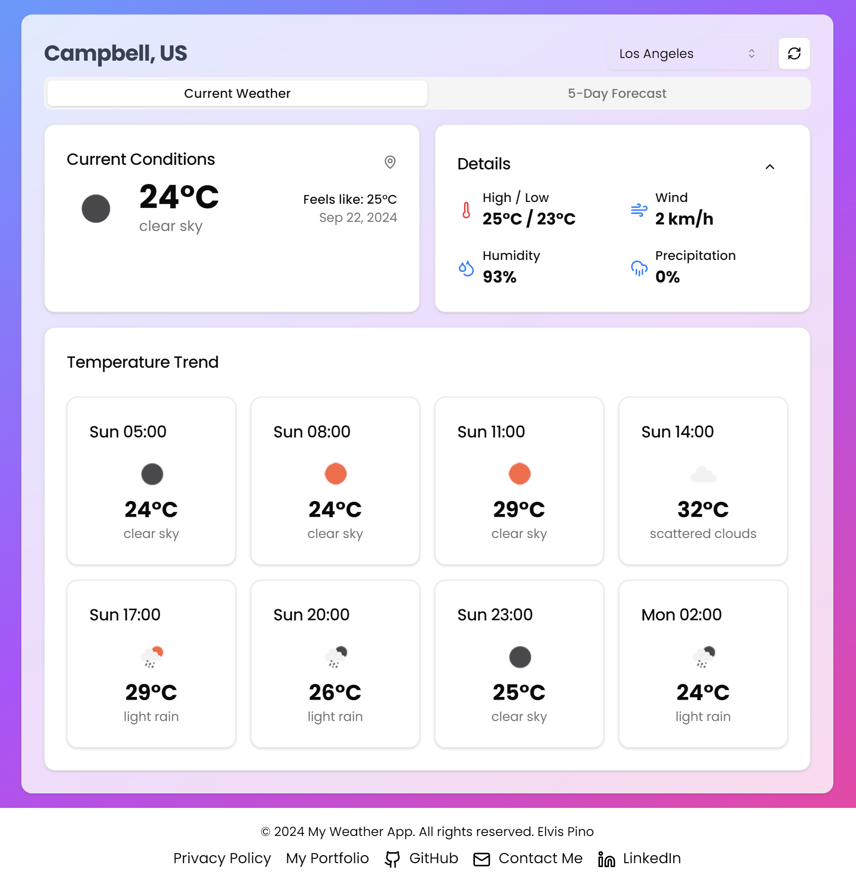

# weather-app
weather app in react + vite  working 
live preview https://weather-app-one-sepia-34.vercel.app/

<h1 align="center">Hellooo, I'm <a href="https://elvisxd.github.io/webside-curriculum/">Elvis</a> 👋</h1>

## technologies 💻

 
<h3 align="center">Weather App</h3>

                                       

 

A comprehensive Weather App that provides real-time weather updates and forecasts. Built using React and TailwindCSS, this app offers a sleek and responsive interface. Users can search for weather information by city and view detailed weather conditions, including temperature, humidity, wind speed, and more. The app also features a dynamic background that changes based on the current weather conditions.

                                                             
</table>                                                                                 

